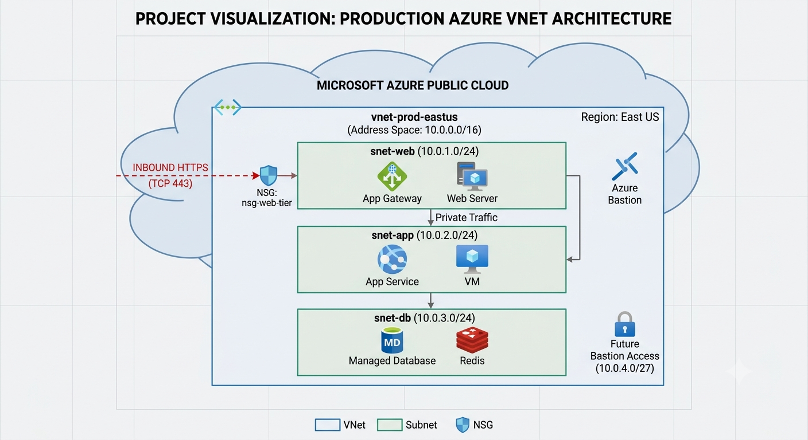

# Build a Virtual Private Cloud (AZURE Vnet) 
A hands-on cloud networking project demonstrating how to create and configure from Scratch and deploy, secure, connect, monitor, and test an Azure Virtual Network.

## Architecture Diagram



---

## Project Overview

This project demonstrates:

- Azure Resource Group
- Azure Virtual Network
- Public subnet
- Private subnet
- Network Security Groups
- Linux Virtual Machines
- VNet Peering
- Azure Network Watcher
- Azure Monitor
- Log Analytics
- Azure Blob Storage
- Private Endpoint
- Private DNS
- Terraform
- Azure CLI

---

## Commands used in the demo

- Log in to Azure
```
- az login
```

- Create Service Principal 
```
az ad sp create-for-rbac -n az-demo --role="Contributor" --scopes="/subscriptions/$SUBSCRIPTION_ID"
```
Note: Use the values generated here to export the variables in the next step

- Set env vars so that the service principal is used for authentication

```
export ARM_CLIENT_ID=""
export ARM_CLIENT_SECRET=""
export ARM_SUBSCRIPTION_ID=""
export ARM_TENANT_ID=""
```

